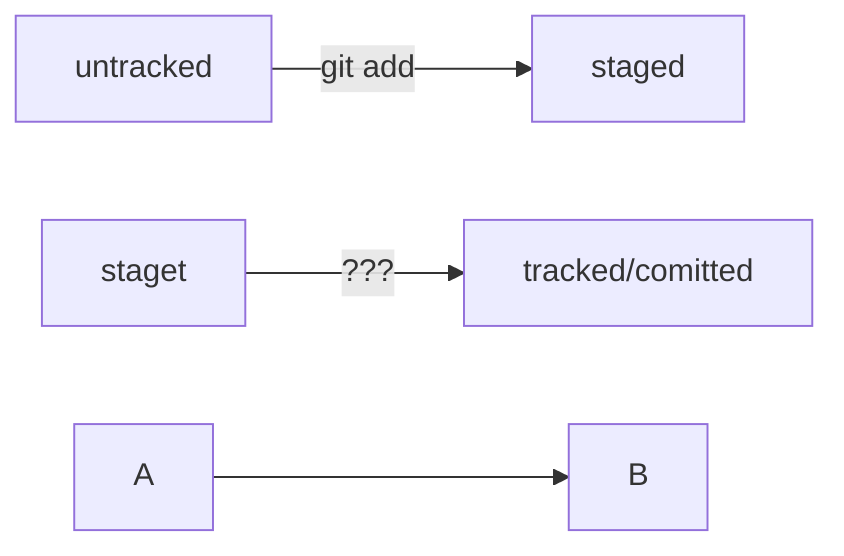
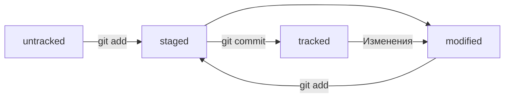

# Шпаргалка markdown

## Выделение текста

Вы можете выделять текст в markdown с помощью символов `_` или `*`. Например:

Пример _курсива_ и **жирного** текста.

Пример ***Жирного курсива*** текста.

Пример ~~зачеркнутого~~ текста.

## Заголовки

Заголовки можно создавать с помощью символа `#`. Чем больше `#`, тем меньше заголовок. Например:

# Заголовок первого уровня
## Заголовок второго уровня
### Заголовок третьего уровня

## Выделение кода

Чтобы выделить текст как код, поместите его в тройные кавычки `````. 

```
mkdir my_project
cd my_project
git init
```

## mermaid-cxema



## Смайл

:white_check_mark: - один из множества.

Это лишь некоторые функции markdown.
 
 ___
 ___

 # Хеш - идентификатор коммита

+ Git преобразует информацию о коммитах с помощью алгоритма SHA-1 и для каждого из них рассчитывает уникальный идентификатор - хеш.
+ Хеш - основной идентификатор коммита и позволяет узнать его автора, дату и содержимое закоммиченных файлов.
+ Все хеши, а также таблицу соответствий `хеш -> информация о коммите` Git хранит в папке `.git`

___
___

# Исследум лог

+ Можно вызвать не только полный лог `git log`, но и сокращённый - это делается командой `git log --oneline`.
+ В сокращённом логе выводятся сокращённые хеши - их можно использовать точно так же, как и полные.

:warning: Если выход из просмотра логов не произошёл автоматически, нажмите `Q` (от англ.Quit - <<Выйти>>) в английской раскладке клавиатуры.

___
___

# HEAD - всему голова

+ В числе прочих файлов в папке `.git` есть служебный файл `HEAD`. Он указывает на самый свежий коммит.
+ Вместо хеша последнего коммита можно написать слово `HEAD` - Git вас поймёт.

___
___

# Статусы файлов в Git

+  `untracked` (англ.<<неотслеживаемый>>)
+  `staged` (англ.<<подготовленный>>)
+  `tracked` (англ.<<отслеживаемый>>)
+  `modified` (фнгл.<<изменённый>>)

:heavy_exclamation_mark: Для файлов в состояниях `staged` и `modified` обычно не указывают, что они также `tracked`, потому что это состояние подразумевается.



1. Файл только что создали. Git ещё не отслеживает содержимое этого файла. Состояние: `untracked`.
2. Файл добавили в strging area с помощью `git add`. Состояние: `staged` (+ `tracked`).
    + Возможно, изменили файл ещё раз. Состояние: `staged`, `modified` (+ `tracked`).Обратите внимание: `staged` и `modified` у одного файла, но у разных его версий.
    + Ещё раз выполнили `git add`. Состояние: `staged` (+ `traced`).
3. Сделали коммит с помощью `git commit`. Состояние: `tracked`.
4. Изменили файл. Состояние: `modified` (+ `tracked`).
5. Снова добавили в staging area с помощью `git add`. Состояние: `staged` (+ `tracked`).
6. Сделали коммит. Состояние: `tracked`.
7. Повторили пункты 4 - 7 много-много раз.